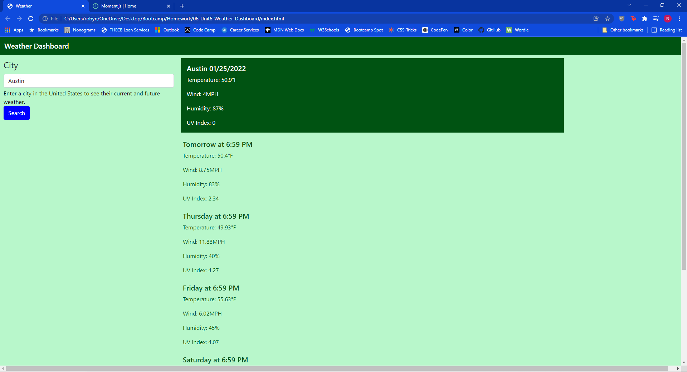

# Weather Dashboard

---

Title: Weather Dashboard
Developer: Robyn Arnecke
Published: GitHub 

---

# Summary 

When the user enters a city within the United States, the page will populate with the current weather and the weather for the next 5 days, including the temperature, wind speed, and UVI. 

The weather information is pulled from the Open Weather API. 

---

# Development 

I started development by making sure that one fetch of the Weather API was functioning correctly. Once I had that and could navigate the data that was provided, I started to add the information to the index.html. 

For future development, I would like to add previous searches into the local storage so that users can easily click on the cities that they frequently search. 